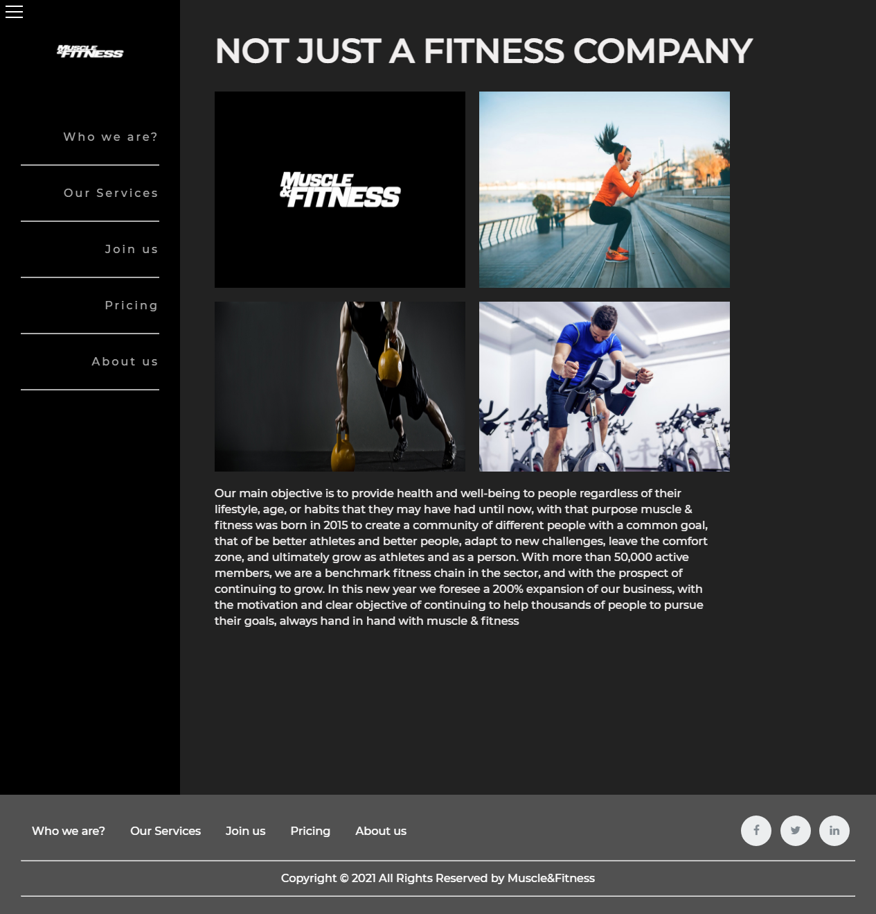
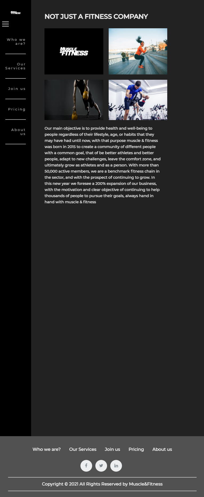

# MUSCLE AND FITNESS - GYM WEBSITE.

### [live site](https://alvaroci.github.io/muscle-fitness-project/)

This page is designed for a made-up client, who wants to have a position on the web, making his company known, in this case his gym business.
The main objective of the web is to first have a site on the web, two so that potential clients can see the type of services it offers, its company philosophy, who they are, what they do and what target audience they target. .


# Wireframes

- Who are we? Wireframe - [View ↣](https://raw.githubusercontent.com/alvaroci/muscle-fitness-project/master/assets/img/wireframes/Homepage.jpg)

- Our Services Wireframe - [View ↣](https://raw.githubusercontent.com/alvaroci/muscle-fitness-project/master/assets/img/wireframes/services.jpg)

- Join Us Page Wireframe - [View ↣](https://raw.githubusercontent.com/alvaroci/muscle-fitness-project/master/assets/img/wireframes/Contact.jpg)

- Pricing Wireframe - [View ↣](https://raw.githubusercontent.com/alvaroci/muscle-fitness-project/master/assets/img/wireframes/Pricing.jpg)

- About Us Wireframe - [View ↣](https://raw.githubusercontent.com/alvaroci/muscle-fitness-project/master/assets/img/wireframes/About.jpg)

## User Experience (UX)

### User stories

#### First Time Visitor Goals:

- As a First Time Visitor, I want to easily understand the main purpose of the organization and learn more about it.
- As a First Time Visitor, I want to be able to easily navigate throughout the site to find content.
- As a First Time Visitor, I want to look for information about what they do, and what services they offer

#### Returning Visitor Goals

- As a Returning Visitor, I want to find new updates and information about the organization.
- As a Returning Visitor, I want to find the best way to get in contact with the organisation with any questions related to their services or my membership
- As a Returning Visitor, I want to find easily new content or new services the may be offering.

#### Frequent User Goals

- As a Frequent User, I want to check to see if there are any newly added content or updates about services or related to the gym situation
- As a Frequent User, I want to check to see if there are any new media content about what they do.
- As a Frequent User, I want to be able to find a easy way to get in contact with the organization.

## Site Map

Through the different sections we can access the sections of the web:

On the first page, we have a couple of images that show us the type of activities carried out by the company, as well as a brief summary of who they are and what they do.

On the second page our services (I would have liked to have had a little more time, but my full-time job has not allowed me), the idea is to make known to customers the services offered and that are practiced in the company (nutrition, weight lifting, running, etc)

On the third page, join us, the client can, if he wishes, contact the company, to receive more information and to request a service.

The fourth page is a page to show the different memberships as well as their price, so that the client gets the idea of ​​what type of company we are, and the prices we have.

On the fifth and last page, the client can learn more about the history of the company, in case he wants to continue learning more about the fictitious muscle & fitness company.
one line added

## Responsiveness

Wrote Media queries for screen size 768px and 480px that applies styles for mobile and tablet size devices, makes it responsive for both of the devices.

## Features

- Responsive on all device sizes
- Interactive elements
- Easy to Navigate
- Simple

## Technologies Used

**Languages Used**

- HTML5
- CSS3

**Frameworks, Libraries & Programs Used**

- Google Fonts:
  Google fonts were used to import the 'Titillium Web' font into the style.css file which is used on all pages throughout the project.
- Git
  Git was used for version control by utilizing the Gitpod terminal to commit to Git and Push to GitHub.
- GitHub:
  GitHub is used to store the projects code after being pushed from Git.

### Existing Features

- **Navigation Bar**

  - Featured on all five pages, the full responsive navigation bar includes links to the Home page, Products Page, Contact, Pricing and About page and is identical in each page to allow for easy navigation.
  - This section will allow the user to easily navigate from page to page across all devices without having to revert back to the previous page via the ‘back’ button.


- **The landing page image**

  - The landing includes some images of the gym with some text information for the user to see exactly which location this site would be applicable to.
  - This section introduces the user to Muscle and Gym with an eye catching Banner to grab their attention


- **The Footer**

  - The footer section includes links to the relevant social media sites for Muscle and Fitness. The links will open to a new tab to allow easy navigation for the user.
  - The footer is valuable to the user as it encourages them to keep connected via social media


### Features Left to Implement

- Mobile menu hamburger function

## Design

### Colour Scheme

The three main colours used are Grey, Black and white.

## Typography

The Arial and Monserrat font is the main font used throughout the whole website.

## Imagery

Imagery is important. The large, and background hero images are designed to be striking and catch the user's attention. It also has a modern, energetic aesthetic.

<!-- Wireframes

        Home Page Wireframe - View

        Mobile Wireframe - View

        Contact Us Page Wireframe - View -->

## Testing

The W3C Markup Validator and W3C CSS Validator Services were used to validate every page of the project to ensure there were no syntax errors in the project.

- **W3C Markup Validator**
  

- **W3C CSS Validator**
  

Further Testing

The Website was tested on Google Chrome, Internet Explorer, Microsoft Edge and Safari browsers.

- Google Chrome - 

- Microsoft Edge - 

- Opera - 

The website was viewed on a variety of devices such as Desktop, Laptop, iPhone7, iPhone 8 & iPhoneX.

- Desktop - 

- Iphone 6,7,8 - 

- Iphone X - 

- Ipad - 

A large amount of testing was done to ensure that all pages were linking correctly.
Friends and family members were asked to review the site and documentation to point out any bugs and/or user experience issues.

Known Bugs

    On Microsoft Edge and Internet Explorer Browsers, all links in Navbar are pushed upwards when hovering over them.

Deployment
GitHub Pages

The project was deployed to GitHub Pages using the following steps...

- Log in to GitHub and locate the GitHub Repository

- At the top of the Repository (not top of page), locate the "Settings" Button on the menu.
- Scroll down the Settings page until you locate the "GitHub Pages" Section.

- Under "Source", click the dropdown called "None" and select "Master Branch".

- The page will automatically refresh.

- Scroll back down through the page to locate the now published site link in the "GitHub Pages" section.

Forking the GitHub Repository

By forking the GitHub Repository we make a copy of the original repository on our GitHub account to view and/or make changes without affecting the original repository by using the following steps...

    Log in to GitHub and locate the GitHub Repository
    At the top of the Repository (not top of page) just above the "Settings" Button on the menu, locate the "Fork" Button.
    You should now have a copy of the original repository in your GitHub account.

Making a Local Clone

    Log in to GitHub and locate the GitHub Repository
    Under the repository name, click "Clone or download".
    To clone the repository using HTTPS, under "Clone with HTTPS", copy the link.
    Open Git Bash
    Change the current working directory to the location where you want the cloned directory to be made.
    Type git clone, and then paste the URL you copied in Step 3.

$ git clone https://github.com/alvaroci/muscle-fitness-project.git

    Press Enter. Your local clone will be created.

$ git clone https://github.com/alvaroci/muscle-fitness-project.git

```
> Cloning into `CI-Clone`...
> remote: Counting objects: 10, done.
> remote: Compressing objects: 100% (8/8), done.
> remove: Total 10 (delta 1), reused 10 (delta 1)
> Unpacking objects: 100% (10/10), done.

```
